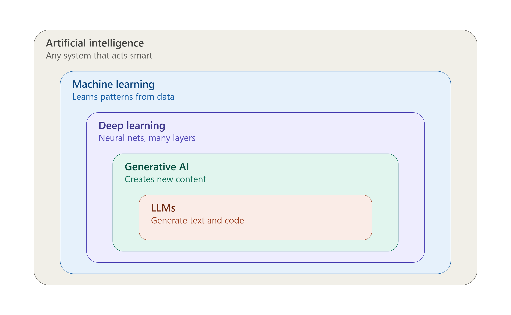
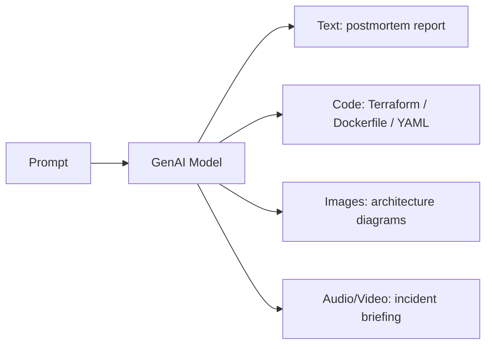
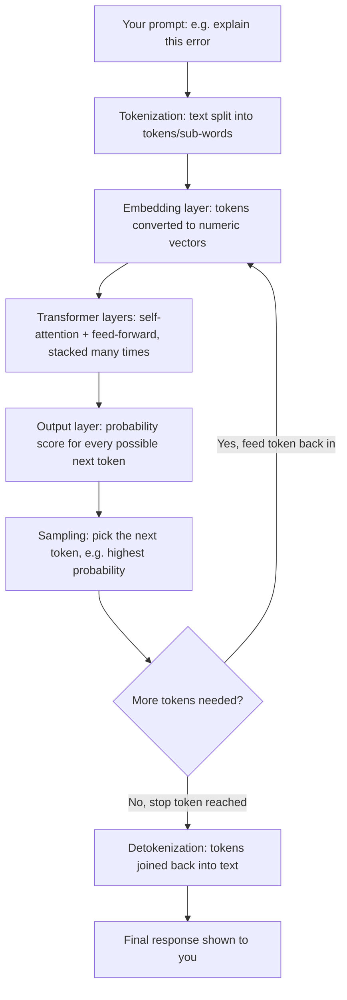
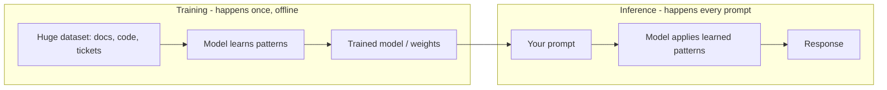
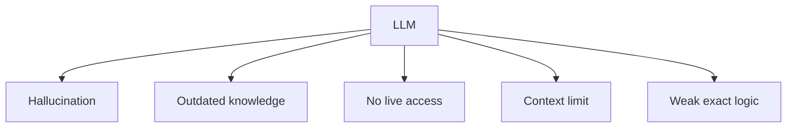

# Day 1 — Core AI Definitions

- **Artificial Intelligence (AI)** — the goal of making machines perform tasks that normally require human intelligence.

- **Machine Learning (ML)** — a way to build AI by learning patterns from data instead of following only hand-written rules.

- **Deep Learning (DL)** — a type of ML that uses neural networks to learn complex patterns in text, images, audio, and data.

- **Generative AI (GenAI)** — AI that creates new content such as text, code, images, audio, or video.

- **Large Language Models (LLMs)** — GenAI models specialized in understanding and generating text and code by predicting the next token.

- **Retrieval-Augmented Generation (RAG)** — enhances an LLM by retrieving relevant external information before generating an answer.

- **AI Agent** — an LLM connected to tools and APIs so it can perform actions, not just generate responses.

- **Agentic AI** — AI systems that can plan, reason, use tools, and execute multiple steps toward a goal.

---

## One-Line Memory Map

AI → ML → DL → GenAI → LLM

LLM + Documents = RAG

LLM + Tools = Agent

Agent + Planning = Agentic AI

---

## Docker / Kubernetes Examples

| Term | Simple meaning | Docker / Kubernetes Example |
|---|---|---|
| **AI** | Smart behavior, however achieved | A chatbot that answers "why is my pod pending?" |
| **ML** | Learns patterns from past data | Learns from past pod restart data to predict which deployments are likely to `CrashLoopBackOff` |
| **DL** | ML using deep neural networks | A neural net trained on container resource-usage patterns to flag abnormal memory spikes across a whole cluster |
| **GenAI** | Creates new content instead of just predicting a label | Generates a brand-new `Dockerfile` or Kubernetes `Deployment` YAML from a plain-English description |
| **LLM** | GenAI specialized in text/code, predicts next token | Reads your `kubectl describe pod` output and explains the `ImagePullBackOff` error in plain English |
| **RAG** | LLM + your own documents, so answers are grounded | Answers "how do we configure our Ingress?" by retrieving your team's actual Helm charts/runbooks, not generic internet knowledge |
| **Agent** | LLM + tools/APIs, so it can act | Actually runs `kubectl get pods -n prod` and `docker logs <container>` itself to check real status before answering |
| **Agentic AI** | Agent + planning, so it handles multi-step goals | Detects a `CrashLoopBackOff`, inspects logs, rolls back to the previous image tag with `kubectl rollout undo`, and verifies the pods become `Ready` — without step-by-step human instructions |

---

## Generative AI — Deep Dive (for DevOps folks)

Regular ML/AI often **predicts a number or a label** (e.g., "will this deployment fail? Yes/No"). **Generative AI** is different — it **creates new content**: text, code, images, audio, video, configs.

### Types of GenAI by output

| Output type | Example |
|---|---|
| Text | Release notes, on-call handover summaries |
| Code | Ansible playbooks, GitHub Actions workflows, Helm charts |
| Images | Network topology or CI/CD pipeline diagrams |
| Audio | Voice alerts summarizing an incident for a phone call |
| Video | AI-generated onboarding walkthrough for a new tool |

### DevOps examples

- Ask it to **write a GitHub Actions workflow** that builds and pushes a Docker image → it generates the full YAML from scratch.
- Ask it to **write a Helm chart** for a new microservice → it drafts `values.yaml`, templates, and `Chart.yaml`.
- Ask it to **summarize last week's incident tickets** into a release-notes-style report → it produces a new written summary.
- Ask it to **generate an Nginx Ingress config** for the same app you described in Terraform → notice how it adapts the same intent to a different tool/format.

### Key distinction

- **Predictive AI/ML** — classifies or predicts (spam/not-spam, will-crash/won't-crash).
- **Generative AI** — produces brand-new content from a prompt.

---

## Large Language Models (LLMs) — Deep Dive (for DevOps folks)

An LLM is a **Generative AI model that specializes in text/code**. It's "large" because it's trained on a huge amount of text (docs, code, books, forums, tickets) and has billions of internal parameters.

**Layer-by-layer, in plain words:**

1. **Tokenization** — your prompt is chopped into small pieces (tokens), not whole words (e.g. "CrashLoopBackOff" might become `Crash`, `Loop`, `Back`, `Off`).
2. **Embedding** — each token is converted into a list of numbers that captures its meaning/context.
3. **Transformer layers (the "brain")** — dozens of stacked layers use **self-attention** to weigh how every token relates to every other token in the prompt (e.g. connecting "pod" with "CrashLoopBackOff" and "restart count").
4. **Output layer** — for the current position, the model produces a probability for every possible next token (e.g. 40% "The", 10% "This", ...).
5. **Sampling** — one token is chosen (often the most likely one), appended to the sequence.
6. **Loop** — the new, longer sequence is fed back in to predict the *next* token, repeating until a stop condition is hit.
7. **Detokenization** — the final list of tokens is converted back into readable text and returned as the response.

**DevOps way to remember it:** *chop it up → understand each piece → relate the pieces to each other → guess the next word → repeat → glue the words into an answer.*

### Key idea

An LLM doesn't "think" like a human. It's really good at predicting **"what token comes next"** based on patterns it saw during training — but it does this so well that it feels like understanding.

### DevOps examples

- You paste a **Kubernetes `CrashLoopBackOff` error** into a chatbot. It doesn't check your cluster — it recognizes the **pattern** of that error text (seen many times in training) and predicts a helpful explanation.
- You paste a **failed Terraform apply output**. The LLM predicts a likely cause and fix based on similar error patterns it has seen, not by inspecting your actual state file.
- You ask it to **review a pull request diff**. It predicts likely issues (missing null checks, bad naming) based on patterns from millions of code reviews — not by running your code.

### Why this matters for DevOps

Because an LLM predicts based on patterns, not live facts, it can be:
- ✅ Great at explaining **familiar** error formats and generating boilerplate configs.
- ⚠️ Wrong or outdated about your **specific** environment, versions, or live state — always verify before running anything in production.

---

## Training vs Inference

One of the most important concepts — and a great DevOps analogy is **building a Docker image vs running a container from it.**

| | Training | Inference |
|---|---|---|
| **When** | Once (or occasionally, to update the model) | Every single time you send a prompt |
| **Cost** | Very expensive — days/weeks, huge GPU clusters | Cheap and fast — seconds |
| **DevOps analogy** | `docker build` — slow, resource-heavy, done once to produce an image | `docker run` — fast, spins up a container from that image every time, over and over |
| **Does it "learn" from your question?** | N/A | ❌ No — running a container doesn't rebuild the image; a prompt doesn't retrain the model |

### DevOps examples

- **Training**: Building a Docker image with `docker build` — you compile, install dependencies, and bake everything into layers once. This is slow and expensive, just like training a model on huge datasets.
- **Inference**: Running `docker run myimage` — starts instantly using the already-built image, exactly like sending a prompt and getting an instant answer from the already-trained model.
- **Training**: To add a new dependency, you must **rebuild the image** (`docker build` again) — just like updating a model's knowledge requires retraining/fine-tuning on new data.
- **Inference**: Running 1,000 containers from the same image doesn't change the image itself — just like asking a model 1,000 questions doesn't change its weights.

## LLM Limitations

LLMs are powerful, but they are **not perfect**. Important to know these before trusting them blindly in production DevOps work.

| Limitation | What it means | DevOps example |
|---|---|---|
| **Hallucination** | Confidently states something false because it *sounds* plausible | Suggests `kubectl scale deployment --auto` — a flag that doesn't actually exist |
| **Outdated knowledge** | Training data has a cutoff date | Recommends deprecated GitHub Actions syntax if trained before an update was released |
| **No live access** | Can't see your actual systems unless connected to a real tool | Can't tell you *your* pod's real status unless it's wired to a plugin that queries your cluster |
| **Context limit** | Can only process a limited amount of text at once | If you paste a massive log file, it may only "see" and use part of it |
| **Weak exact logic** | Struggles with precise, rule-based counting/structure | Miscounts indentation levels in a long YAML file, producing a broken manifest |

**Golden rule for DevOps use:** Always **verify AI-generated scripts, configs, and commands** in a safe/staging environment before running them in production — never trust and deploy blindly.
